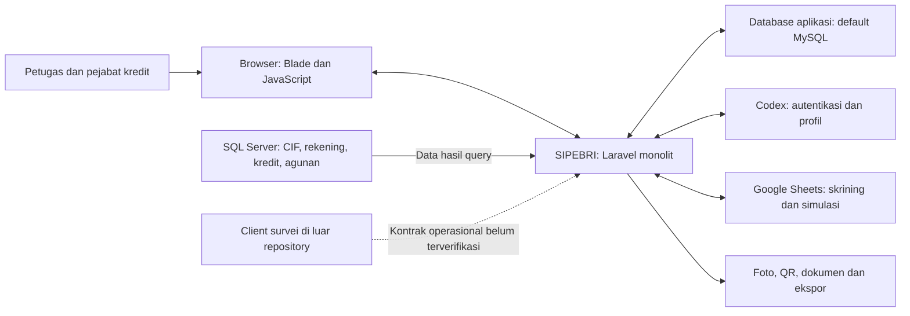
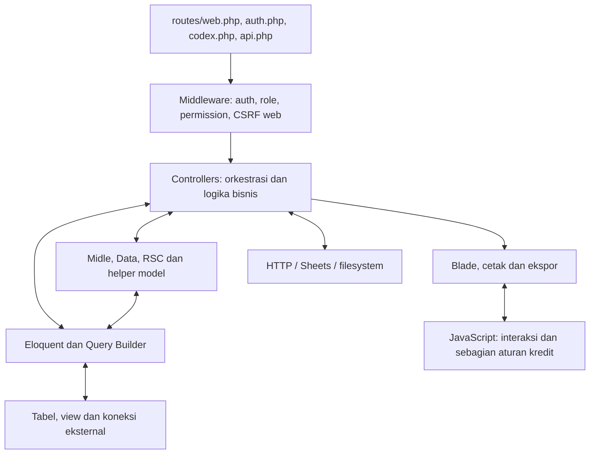
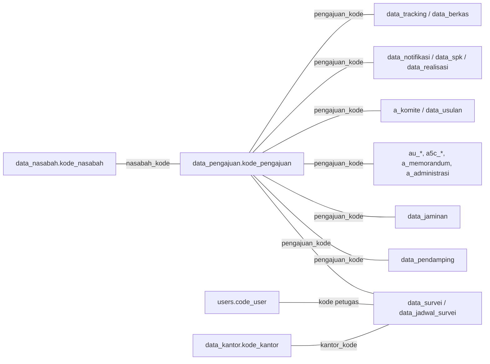

# Analisis Sistem Existing SIPEBRI

Identifikasi **EXISTING 1.0**, 16 September 2026. Hanya kondisi existing. Lihat [indeks](README.md) dan [analisis DDL](database/analisis-skema-mysql.md).

## 1. Ringkasan eksekutif

**[B]** SIPEBRI adalah **Sistem Pemberian Kredit**. Pemilik sistem menyampaikan bahwa aplikasi dibangun pada masa awal belajar Laravel dan perlu dianalisis terlebih dahulu sebelum diperbarui karena cakupannya besar.

**[S]** Aplikasi merupakan monolit Laravel dengan halaman server-rendered Blade. Sistem mendukung pendaftaran, analisa dan keputusan kredit, dokumen perjanjian, pencatatan realisasi, serta modul pendukung seperti RSC, prospek, skrining, pelaporan, dan perpindahan berkas.

**Kesimpulan:** pengetahuan bisnis tertanam dalam controller, helper model, JavaScript, query dan view. Pengguna mengonfirmasi ekspor struktur diambil langsung dari produksi, proyek memakai database lokal hasil restore, dan trigger/stored procedure/function/event database tidak digunakan. Sejarah on_current kini terjawab: flag CBS lama setelah pembuatan rekening, **tidak lagi digunakan bisnis**; filter source residual masih ada. Integrasi API dropping CBS baru tidak tersedia pada source yang diidentifikasi. Pemeriksaan runtime dan versi source produksi tidak dilakukan dalam paket ini.

Analisis ini tidak memberikan penilaian kuantitatif atas kualitas produksi, performa, keamanan, atau kepuasan pengguna karena pengukuran tersebut belum dilakukan.

## 2. Tujuan dan ruang lingkup

### 2.1 Tujuan baseline

1. Mendokumentasikan proses existing.
2. Memetakan komponen, ketergantungan data, dan titik integrasi.
3. Memisahkan fakta kode, aturan bisnis terkonfirmasi, risiko, dan ketidakpastian.
4. Menyediakan inventaris existing untuk referensi terpisah.

### 2.2 Cakupan

| Area                               | Kedalaman baseline                                                                                                                            |
| ---------------------------------- | --------------------------------------------------------------------------------------------------------------------------------------------- |
| Alur kredit utama dan status       | Ditelusuri sampai metode mutasi dan filter antrean utama                                                                                      |
| Aktor, otorisasi, dan cakupan data | Pemetaan lapisan route, query, helper, dan menu; belum matriks akses final organisasi                                                         |
| Data bisnis                        | Kamus logis dan ekspor fisik 104 tabel/26 view; default/constraint serta kompatibilitas kolom prioritas diperiksa, bukan sertifikasi produksi |
| Integrasi                          | Arah pertukaran dan titik kode; tidak menghubungi layanan                                                                                     |
| RSC dan modul pendukung            | Inventaris dan batas ketergantungan; detail proses perlu elaborasi tersendiri                                                                 |
| Pengujian dan operasi              | Inventaris artefak yang tersedia; tanpa eksekusi atau observasi produksi                                                                      |

**Di luar paket ini:** perubahan sistem, desain TO-BE, implementasi, dan pengujian perubahan.

## 3. Inventaris teknologi dan kode

### 3.1 Teknologi

| Komponen                       | Deklarasi / versi yang ditemukan                  | Catatan                                                                                           |
| ------------------------------ | ------------------------------------------------- | ------------------------------------------------------------------------------------------------- |
| PHP                            | Manifest `^8.0.2`                                 | Versi runtime belum diperiksa                                                                     |
| Laravel                        | Manifest `^9.19`; lock `9.52.16`                  | Monolit MVC/Blade                                                                                 |
| Breeze / Sanctum               | Lock `1.19.2` / `3.3.3`                           | Scaffold autentikasi dan dukungan token; pemasangan paket tidak membuktikan semua API terlindungi |
| Spatie Permission              | Lock `5.11.1`                                     | Role, permission, dan middleware                                                                  |
| Google API Client / Guzzle     | Lock `2.17.0` / `7.9.2`                           | Sheets dan HTTP eksternal                                                                         |
| Laravel Excel / PhpSpreadsheet | Lock `3.1.57` / `1.29.1`                          | Ekspor berbasis view dan spreadsheet langsung                                                     |
| Vite / plugin Laravel          | Lock `4.4.6` / `0.7.8`                            | Script `dev` dan `build` pada manifest npm                                                        |
| Tailwind / Alpine / Axios      | Lock `3.3.3` / `3.12.3` / `1.4.0`                 | Terutama layout berbasis Vite/Breeze                                                              |
| UI kredit utama                | Blade, AdminLTE, Bootstrap, jQuery                | Aset lokal dan sebagian CDN; beberapa layout hidup berdampingan                                   |
| Pendukung dokumen              | QRCode, Intervention Image, Terbilang, SweetAlert | Lihat manifest Composer                                                                           |
| Test                           | Pest `1.23.1`, PHPUnit transitif `9.6.20`         | Hasil test dan coverage belum diketahui                                                           |

Sumber: [composer.json](../composer.json), [composer.lock](../composer.lock), [package.json](../package.json), [package-lock.json](../package-lock.json).

**Penting untuk reproduksi:** meskipun manifest root mengizinkan PHP 8.0.2, lockfile memuat `symfony/css-selector` dan `symfony/string` 7.1 yang mensyaratkan PHP `>=8.2`, serta ZipStream yang mensyaratkan PHP 64-bit. Dengan demikian, **PHP minimal 8.2 64-bit merupakan syarat perlu untuk lockfile ini**, bukan jaminan seluruh extension/driver sudah kompatibel. Versi PHP produksi, extension GD/ZIP/XML/mbstring, dan driver SQL Server perlu diperiksa secara terpisah.

### 3.2 Inventaris source lokal

| Artefak                                      | Hasil inventaris                                                                      |
| -------------------------------------------- | ------------------------------------------------------------------------------------- |
| File PHP di `app/Http/Controllers`, rekursif | 106, termasuk controller dasar dan subfolder                                          |
| File PHP di `app/Models`                     | 24                                                                                    |
| Migrasi aplikasi                             | 6 file; tidak mencakup skema bisnis lengkap                                           |
| Ekspor struktur MySQL dari pengguna          | 104 tabel, 26 view, 24 tabel RSC termasuk dalam total; empat FK pivot permission/role |
| Test                                         | 9 file `*Test.php`, 24 deklarasi test                                                 |
| README awal                                  | Boilerplate Laravel, bukan runbook SIPEBRI                                            |

Jumlah file adalah indikator cakupan, bukan ukuran kompleksitas atau kualitas.

## 4. Inventaris modul

| Modul                    | Tanggung jawab yang terlihat                                             | Titik kode utama                                                                                            |
| ------------------------ | ------------------------------------------------------------------------ | ----------------------------------------------------------------------------------------------------------- |
| Identitas dan akses      | Login eksternal/lokal, profil, user, role, permission                    | `AuthController`, `Admin/*`, `routes/auth.php`, `routes/codex.php`                                          |
| Pendaftaran              | Nasabah, pendamping, pengajuan, agunan, penugasan surveyor               | `NasabahController`, `PendampingController`, `PengajuanController`, `AgunanController`, `SurveiController`  |
| Otorisasi                | Pemeriksaan bagian dan konfirmasi pengajuan/PK                           | `KonfirmasiController`                                                                                      |
| Survei dan penjadwalan   | Penugasan, jadwal, jadwal ulang, konteks survei                          | `PenjadwalanController`, `AnalisaController`, `Api/UploadController`                                        |
| Analisa kredit           | Usaha, keuangan, kepemilikan, jaminan, 5C, kualitatif, memorandum, biaya | `Usaha*Controller`, `Analisa*Controller`, `DataAnalisa5CController`, `AdministrasiController`, `Midle`      |
| Komite                   | Usulan, eskalasi, keputusan, pengembalian berkas                         | `KomiteController`, `Midle::persetujuan_komite_*`, `persetujuan_komite.js`                                  |
| Dokumen dan realisasi    | Notifikasi, penolakan, PK/SPK, cetak, foto, konfirmasi selesai           | `DataCetakController`, `CetakController`, `NotifikasiController`, `Administratif/*`                         |
| Dropping                 | Tampilan data CIF, jaminan, kredit, pembatalan terkait SPK               | `DroppingController`; pembacaan `send_*` bukan bukti posting dana                                           |
| RSC                      | Rescheduling kredit internal/eksternal, analisa, persetujuan, dokumen    | `RSCController`, controller `RSC*`, model `RSC`                                                             |
| CIF, CGC, resort, master | Referensi nasabah/rekening, produk, kantor, pekerjaan, pendidikan        | `TabunganController`, `CGCController`, `Admin/*`                                                            |
| Prospek                  | Kontak/follow-up dan closing prospek                                     | `ProsfekController`                                                                                         |
| Skrining dan simulasi    | Referensi/pencatatan skrining dan perhitungan berbasis Sheets            | `SkriningController`, `PerhitunganController`                                                               |
| Berkas dan tracking      | Pengiriman/penerimaan fisik berkas, milestone, informasi tracking        | `BerkasController`, `TrackingController`, `FrontController`                                                 |
| Dashboard/laporan        | Agregasi, monitoring petugas, cetak dan ekspor                           | `DashboardController`, `Monitoring*Controller`, `CetakLaporanController`, `ExportController`, `app/Exports` |

RSC merupakan subsistem signifikan, bukan sekadar variasi status pengajuan baru. Baseline ini belum menganggap detail alurnya telah disetujui pengguna.

## 5. Arsitektur AS-IS

### 5.1 Konteks sistem

Arah SQL Server menunjukkan data yang dibaca; aplikasi tetap mengirim parameter query. Pengguna menjelaskan CBS lama dahulu menulis on_current sesudah data dimasukkan dan rekening kredit dibuat; kini flag tidak dipakai bisnis. Pengiriman siap realisasi melalui API CBS baru untuk dropping belum tersedia pada source yang diidentifikasi. Koneksi SQL Server pada diagram tidak otomatis sama dengan CBS lama/baru. Nasabah adalah subjek data; portal pengajuan mandiri oleh nasabah belum terverifikasi.

### 5.2 Struktur internal

**[S] Karakteristik penting:**

- `routes/web.php` menjadi pusat route; logika bisnis banyak langsung berada di controller.
- `Midle` mempertemukan query, perhitungan, format keluaran, antrean komite, dan dokumen. Nama model tidak selalu mewakili satu entitas/tabel.
- Model Eloquent digunakan berdampingan dengan join eksplisit `DB::table`; tidak semua relasi model selaras dengan kunci bisnis.
- Aturan komite juga berada di JavaScript. Menyalin backend saja tidak cukup untuk merekonstruksi perilaku pengguna.
- Ada transaksi dan validasi pada sejumlah operasi, tetapi batas transaksi tidak selalu mencakup seluruh perubahan satu proses bisnis.
- `theme/app.blade.php` adalah acuan utama layar kredit. `templates/app.blade.php` (Tabler) dan `layouts/app.blade.php` (Breeze/Vite) juga tersedia.
- `AppServiceProvider::boot()` menetapkan locale `id`, Carbon `id`, dan zona waktu `Asia/Jakarta`. Deklarasi locale pada file konfigurasi tidak boleh dibaca terpisah dari override provider.

Sumber: [routes](../routes/web.php), [Midle](../app/Models/Midle.php), [theme](../resources/views/theme/app.blade.php), [provider](../app/Providers/AppServiceProvider.php).

## 6. Identitas dan batas otorisasi

1. **[S]** Form login aktif mengirim ke `codex.login`. `AuthController::authenticate()` memakai API Codex dan menyinkronkan pengguna lokal. Route login Laravel standar tetap tersedia.
2. **[S]** Role/permission lokal menggunakan Spatie. `HasRoleMiddleware` memeriksa bahwa pengguna memiliki suatu role, bukan otomatis berhak atas seluruh operasi atau record.
3. **[S]** Kontrol tersebar pada middleware route, cabang role di controller/helper, filter kepemilikan/kantor, dan `@can` pada menu.
4. **[S]** `AuthServiceProvider` memberi Administrator bypass Gate. Hal itu tidak otomatis melewati setiap middleware `role` yang memeriksa keanggotaan role secara langsung.
5. **[V]** Matriks akses produksi, pengguna multi-role, periode peninjauan hak akses, dan batas maker-checker belum disahkan.

Sumber: [form login](../resources/views/auth/login.blade.php), [middleware](../app/Http/Middleware/HasRoleMiddleware.php), [AuthServiceProvider](../app/Providers/AuthServiceProvider.php), [navigasi](../resources/views/components/navigation.blade.php).

## 7. Model data logis AS-IS

### 7.1 Kunci dan hubungan yang diamati

Diagram ini tetap **peta join logis**, bukan ERD constraint. Ekspor DDL kini menunjukkan bahwa hubungan bisnis di bawah tidak dideklarasikan sebagai foreign key. Beberapa child mempunyai unique `pengajuan_kode` (maksimal satu baris), tetapi itu tidak mewajibkan child atau menjamin parent ada. Detail constraint tersedia pada [analisis skema](database/analisis-skema-mysql.md).

### 7.2 Kamus data ringkas

Kolom di bawah bersifat representatif, bukan daftar lengkap atau definisi tipe data.

| Objek                                                              | Kunci/atribut penting                                                                                                             | Makna dan catatan                                                                             |
| ------------------------------------------------------------------ | --------------------------------------------------------------------------------------------------------------------------------- | --------------------------------------------------------------------------------------------- |
| `data_nasabah`                                                     | `kode_nasabah`, `no_cif`, identitas, tanggal lahir, alamat, foto, `otorisasi`                                                     | Subjek kredit; pendaftaran mencari pasangan identitas dan tanggal lahir                       |
| `data_pengajuan`                                                   | `kode_pengajuan`, `nasabah_kode`, `produk_kode`, `plafon`, `temp_plafon`, tenor, `status`, `tracking`, `on_current`, `input_user` | Pusat proses kredit; status/tracking berbeda; on_current legacy tidak dipakai bisnis                                              |
| `data_pendamping`                                                  | `pengajuan_kode`, identitas, hubungan, foto, `otorisasi`                                                                          | Pendamping pengajuan                                                                          |
| `data_survei`                                                      | `pengajuan_kode`, kode kantor/petugas, tanggal/jadwal ulang, lokasi, foto, `otorisasi`                                            | Penugasan dan konteks survei                                                                  |
| `data_jadwal_survei`                                               | `pengajuan_kode`, `surveyor_kode`, `tgl_jadwal`, `tgl_survei`                                                                     | Jadwal efektif terpisah dari data survei                                                      |
| `data_jaminan`                                                     | `pengajuan_kode`, `nasabah_kode`, jenis aset/dokumen, nilai, foto, `otorisasi`, `on_current`                                      | Agunan kredit; jangan disamakan dengan model `Agunan` yang memetakan master jenis agunan      |
| `data_kepemilikan`                                                 | `kode_kepemilikan`, `pengajuan_kode`, jumlah/nilai aset                                                                           | Kepemilikan rumah tangga, tidak selalu agunan yang diikat                                     |
| `au_perdagangan`, `au_pertanian`, `au_jasa`, `au_lainnya`          | `pengajuan_kode`, `kode_usaha`, pendapatan/biaya/laba                                                                             | Header analisa usaha; detail `bu_*`/`du_*` dihubungkan melalui `usaha_kode`                   |
| `au_keuangan`, `bu_keuangan`                                       | `pengajuan_kode`, `kode_keuangan`, `keuangan_kode`, nominal/biaya                                                                 | Kemampuan keuangan dan biaya terkait                                                          |
| `a5c_character`, `a5c_capacity`, `a5c_collateral`, `a5c_condition` | `pengajuan_kode`, `kode_analisa`, evaluasi, `rc`                                                                                  | Capital juga tersimpan di `a5c_capacity`; tidak diasumsikan ada tabel `a5c_capital`           |
| `au_kualitatif`, `a_swot`, `a_tambahan`                            | `pengajuan_kode`, penilaian/catatan                                                                                               | Penilaian kualitatif dan tambahan                                                             |
| `a_kebutuhan_dana`, `a_memorandum`, `a_administrasi`               | `pengajuan_kode`, usulan, sandi klasifikasi, biaya                                                                                | Memo analisa dan administrasi                                                                 |
| `a_komite`                                                         | `pengajuan_kode`, slot petugas/catatan/waktu komite                                                                               | Struktur slot keputusan, bukan otomatis event history lengkap                                 |
| `data_usulan`, `pengembalian_berkas`                               | `pengajuan_kode`, petugas/role, nilai usulan/catatan                                                                              | Usulan dan perbaikan berkas                                                                   |
| `data_notifikasi`, `data_penolakan`, `data_spk`                    | `pengajuan_kode`, nomor dokumen, `otorisasi` SPK                                                                                  | Dokumen keputusan/perjanjian                                                                  |
| `data_realisasi`                                                   | `pengajuan_kode`, foto, catatan, petugas, `created_at_si`                                                                         | Pencatatan bukti; kolom `status` yang ditulis controller **tidak ada pada DDL**, konflik R-22 |
| `data_tracking`                                                    | `pengajuan_kode`, tujuh timestamp milestone                                                                                       | Ringkasan waktu yang dapat ditimpa; bukan log append-only                                     |
| `data_berkas`                                                      | `pengajuan_kode`, kantor/petugas asal-tujuan, waktu kirim/terima                                                                  | Perpindahan fisik berkas, terpisah dari keputusan kredit                                      |
| `users` dan pivot permission                                       | `id`, `code_user`, data kantor/petugas                                                                                            | Join bisnis lazim memakai `code_user`; pivot otorisasi memakai identitas user                 |
| `data_produk`, `data_kantor`, master lain                          | Kode dan nama; counter SPK/parameter produk                                                                                       | Referensi lintas modul                                                                        |
| `data_prosfek`                                                     | `code_user`, kontak, follow-up, closing                                                                                           | Relasi konversi otomatis ke pengajuan belum dipastikan                                        |

Sumber representatif: [NasabahController](../app/Http/Controllers/NasabahController.php), [PengajuanController](../app/Http/Controllers/PengajuanController.php), [DataAnalisa5CController](../app/Http/Controllers/DataAnalisa5CController.php), [DataCetakController](../app/Http/Controllers/DataCetakController.php), [BerkasController](../app/Http/Controllers/BerkasController.php).

### 7.3 RSC, view, dan objek eksternal

- **RSC:** `rsc_data_pengajuan`, `rsc_data_survei`, kelompok analisa `rsc_au_*`, `rsc_analisa_keuangan`, `rsc_agunan`, `rsc_data_jaminan`, `rsc_biaya`, `rsc_data_usulan`, notifikasi/penolakan/SPK RSC. Kunci umumnya `kode_rsc`.
- Seluruh 24 tabel RSC terinventarisasi dalam ekspor. `rsc_spk` dan `rsc_data_spk` terbukti dua tabel berbeda, masing-masing unique `kode_rsc`; jangan digabung tanpa pemetaan fungsi dan data.
- Pendaftaran RSC eksternal memakai nomor rekening pinjaman pada beberapa field yang pada alur internal berisi kode lokal, termasuk `nasabah_kode`. Identitas lintas sumber perlu dipetakan sebelum normalisasi.
- Definisi 26 view, termasuk `v_users`, `v_validasi_pengajuan`, `v_resort`, `v_tabungan` dan objek jaminan kini tersedia dalam ekspor, tetapi belum direproduksi migration. Seluruh dependensi nama langsung view terpetakan; validitas query/privilege/runtime belum diuji.
- SQL Server dibaca melalui objek antara lain `m_cif`, `m_loan`, `m_tabunganc`, `m_tabunganb`, `m_loan_tagihan`, dan data jaminan. Model `Tabungan` justru memetakan `m_cif`.
- `send_cif`, `send_jaminan`, `send_kredit`, dan `data_droping` adalah **view biasa yang dihitung saat query**, bukan tabel antrean yang memiliki penulis sendiri. Filter on_current pada view tersebut residual; bukan kontrak integrasi API CBS baru. Penulis flag historis adalah CBS lama; detail pemakaian setiap view tidak diasumsikan. Sebagian tanggal memakai `CURDATE()`, bukan tanggal transaksi tersimpan.

Sumber: [RSCController](../app/Http/Controllers/RSCController.php), [RSC model](../app/Models/RSC.php), [DroppingController](../app/Http/Controllers/DroppingController.php), [Tabungan model](../app/Models/Tabungan.php).

### 7.4 Kesenjangan skema

Ekspor MySQL pengguna memuat 104 tabel/26 view dan menyebut versi 8.0.45 pada metadata. Default pengajuan terverifikasi pada ekspor: `Lengkapi Data`, `Verifikasi Data`, `on_current='0'`, `is_entry='0'`, `otorisasi=N`; otorisasi SPK juga default `N`.

Enam migrasi tetap tidak mereproduksi objek tersebut. Migrasi tambahan menggunakan `user_code`, sedangkan kode bisnis dan ekspor mempunyai `users.code_user`; beberapa kolom lain juga berbeda. Tabel `migrations` tanpa data tidak membuktikan riwayat eksekusi.

Hanya empat FK pada pivot permission/role; tidak ada FK bisnis/RSC. Unique kode pengajuan, identitas nasabah, dan nomor SPK sudah ada, tetapi bukan jaminan penomoran atomik atau relasi lengkap. Nominal/tanggal tertentu berupa VARCHAR; kolom nominal lain berupa INT/BIGINT tanpa DECIMAL/CHECK pada ekspor.

**Konflik yang perlu diselesaikan sebelum reproduksi:** controller menulis `data_realisasi.status` yang tidak ada; pendaftaran parsial mengabaikan kolom NOT NULL tanpa default; satu jalur batal PK menambah suffix ke kolom VARCHAR(8). `strict=false` terlihat pada konfigurasi source, tetapi SQL mode efektif belum diperiksa. Lihat R-22–R-24.

**[B] Konfirmasi 16 September 2026:** ekspor berasal langsung dari database produksi; proyek terhubung ke lokal hasil restore; trigger/stored procedure/function/event DB tidak digunakan. Keterangan ini melengkapi bukti DDL, bukan hasil inspeksi koneksi oleh asisten.

**[V] Masih dibutuhkan:** versi source produksi, kemungkinan perubahan setelah restore, SQL mode/privilege efektif, dampak residual filter, kontrak data terkini dan fixture sintetis. Tidak perlu mencari penulis aktif on_current; flag tidak dipakai bisnis lagi. Database lokal hasil restore tidak otomatis anonim atau disposable; tidak boleh dipakai untuk `RefreshDatabase` tanpa lingkungan test terpisah. Koneksi SQL Server, Codex, Sheets dan side effect lain belum dikonfirmasi terisolasi. Tidak membutuhkan dump data nasabah untuk tahap ini.

Model `Survei` dan `Survey` sama-sama memetakan `data_survei`. `Survei::pengajuan()` menunjuk kelas `Survei`, dan sejumlah relasi tidak menyebut kunci khusus. Mengaktifkan eager loading berdasarkan relasi tersebut tanpa validasi dapat mengubah hasil.

## 8. Kontrak integrasi yang terlihat

| ID     | Integrasi     | Pertukaran AS-IS                                                                                  | Belum diketahui / konsekuensi                                                                                                             |
| ------ | ------------- | ------------------------------------------------------------------------------------------------- | ----------------------------------------------------------------------------------------------------------------------------------------- |
| INT-01 | Codex         | Kredensial login dikirim; identitas/profil diterima dan disimpan lokal; permintaan ganti password | Sumber otoritatif identitas/password, pencabutan sesi, SLA, perilaku saat layanan gagal; role lokal tidak diasumsikan tersinkron otomatis |
| INT-02 | SQL Server | Query CIF, rekening, pinjaman, tagihan dan agunan; sebagian data disalin ke aplikasi | Hak koneksi, freshness, sumber otoritatif dan rekonsiliasi; hubungan SQL Server ke CBS lama/baru belum disahkan. Bukan bukti integrasi API dropping CBS baru |
| INT-03 | Google Sheets | Baca referensi/hasil; append/update skrining; tulis input simulasi                                | Pemilik formula, revisi formula, akses data pribadi, konkurensi, retry/idempotency, retention                                             |
| INT-04 | Client survei | UI menyebut unggah foto melalui client; route API upload tersedia                                 | Versi client dan jalur nyata; metode upload yang diperiksa berhenti sebelum persistensi dan menarget RSC                                  |
| INT-05 | File/ekspor   | Foto dan QR ke storage; cetak dan spreadsheet ke pengguna                                         | Klasifikasi akses, retensi, arsip, penghapusan, backup dan pemeriksaan integritas                                                         |
| INT-06 | CBS lama: historis; CBS baru: kondisi existing | [B] CBS lama dahulu memasukkan pengajuan, membuat rekening, mengisi on_current; kini flag tidak dipakai bisnis. [S] Filter legacy masih ada | [B] CBS baru sudah digunakan organisasi; integrasi API pengiriman data siap realisasi untuk dropping belum tersedia pada source yang diidentifikasi. Tidak ada implementasi integrasi API dalam baseline |

Tidak dicatat hostname internal, spreadsheet ID, service account, token, atau kredensial. Integrasi SLIK/insurer secara langsung tidak boleh disimpulkan hanya dari nama dokumen atau simulasi asuransi.

## 9. Kondisi operasional dan nonfungsional

| Aspek           | Bukti repository [S]                                                                                        | Data yang diperlukan [V]                                                                                          |
| --------------- | ----------------------------------------------------------------------------------------------------------- | ----------------------------------------------------------------------------------------------------------------- |
| Deployment      | Front controller Laravel dan aturan Apache tersedia; runbook aplikasi tidak ditemukan                       | Topologi nyata, OS/web server, TLS, PHP/extension, konfigurasi per lingkungan                                     |
| Build           | Composer hooks dan Vite `dev`/`build`                                                                       | Hasil build bersih, artefak rilis, kompatibilitas plugin halaman                                                  |
| Scheduler/queue | Tidak ada task scheduler aktif di kernel yang diperiksa; fallback queue `sync`                              | Job eksternal/cron, driver deployment, retry, monitoring                                                          |
| Session/cache   | Fallback file; `logoutSession()` mengakses tabel sessions                                                   | Driver aktual, pencabutan sesi lintas perangkat, skalabilitas                                                     |
| Penyimpanan     | Foto identitas/agunan/realisasi memakai public disk; mapping `public/storage`                               | Akses web efektif, retensi, kapasitas, malware scanning, backup                                                   |
| Logging         | Konfigurasi stack/single; kanal daily tersedia jika dipilih; beberapa error dicatat                         | Redaksi data sensitif, retensi nyata, alert, korelasi transaksi dan penanganan insiden                            |
| Integritas      | Transaksi parsial dan nomor increment aplikasi; unique bisnis tertentu ada, FK bisnis tidak ada pada ekspor | Kesesuaian constraint produksi, duplicate/orphan rate, uji konkurensi dan rollback                                |
| Audit           | Timestamp milestone dan slot komite dapat diperbarui                                                        | Kebutuhan bukti siapa–apa–sebelum/sesudah–kapan–alasan; retensi dan akses auditor                                 |
| Performa        | Join lintas tabel, beberapa query mengambil data sebelum pagination                                         | Volume, query plan, baseline latency/error, jumlah pengguna serentak                                              |
| Pengujian       | 24 test: 23 feature scaffold auth/profil/contoh dan 1 unit trivial                                          | Workflow kredit, jalur Codex aktif, akses, integrasi dan perhitungan belum memiliki coverage yang teridentifikasi |
| CI/recovery     | Tidak ditemukan pipeline/runbook aplikasi dalam lokasi repository yang diperiksa                            | Pipeline eksternal, bukti restore, RPO/RTO dan rollback                                                           |

Sumber: [config](../config), [Console Kernel](../app/Console/Kernel.php), [Pest](../tests/Pest.php), [phpunit.xml](../phpunit.xml).

**Tidak ada angka SLA, RPO/RTO, coverage, atau performa yang diasumsikan.** Target operasional/nonfungsional tidak ditetapkan dalam paket existing ini.

## 10. Batas paket

Paket ini hanya mengidentifikasi existing. Perubahan sistem tidak dibahas di sini.

Lanjut: [proses bisnis](proses-bisnis-existing.md), [temuan](temuan-dan-risiko.md), [bukti/traceability](validasi-dan-traceability.md).
