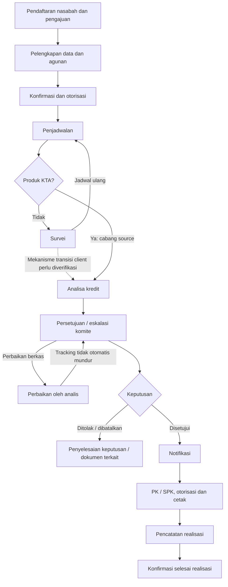

# Proses Bisnis Existing SIPEBRI

Identifikasi **EXISTING 1.0**. Label **[B]/[S]/[V]** mengikuti [indeks](README.md). Memisahkan tujuan proses, maksud kode, dan kompatibilitas [DDL](database/analisis-skema-mysql.md). Runtime belum diuji.

## 1. Aktor dan cakupan data

Tabel ini menggambarkan akses/antrean yang **diamati dalam source**, bukan matriks kewenangan final atau jaminan pembatasan seluruh endpoint.

| Aktor/peran                       | Aktivitas/antrean yang terlihat                                                    | Cakupan data yang diamati                                                                                     |
| --------------------------------- | ---------------------------------------------------------------------------------- | ------------------------------------------------------------------------------------------------------------- |
| Customer Service                  | Pendaftaran/pelengkapan; analisa/komite saat ditugaskan; PK/realisasi sesuai route | Pengajuan awal berdasarkan `input_user`; komite berdasarkan surveyor; PK/realisasi berdasarkan kantor         |
| Kepala Kantor Kas                 | Pendaftaran, penugasan/analisa, dan tahapan terkait sesuai peran                   | Pengajuan sendiri; penjadwalan berdasarkan `kasi_kode`; komite berdasarkan surveyor                           |
| Head Teller / Kabag Operasional   | Otorisasi pengajuan                                                                | Antrean `Minta Otorisasi`; query yang diperiksa tidak membatasi kantor                                        |
| Staff Analis                      | Survei/analisa, usulan komite                                                      | `surveyor_kode` pengguna; komite tahap `Persetujuan Komite`                                                   |
| Kasi Analis                       | Penjadwalan, pemeriksaan/escalation komite                                         | `kasi_kode` pengguna; komite tahap `Naik Kasi`                                                                |
| Kabag Analis                      | Keputusan/eskalasi komite                                                          | Antrean `Naik Komite I`, tanpa filter kantor pada helper yang diperiksa                                       |
| Direktur Bisnis                   | Keputusan/eskalasi komite                                                          | Antrean `Naik Komite II`, lintas kantor pada helper yang diperiksa                                            |
| Direksi                           | Keputusan komite tingkat lanjut                                                    | Antrean `Naik Komite III`, lintas kantor pada helper yang diperiksa                                           |
| Realisasi                         | Pembuatan PK dan pencatatan realisasi                                              | Kantor survei sesuai kantor pengguna                                                                          |
| Admin Kredit                      | Administrasi/cetak tertentu                                                        | Daftar cetak PK memiliki pengecualian scope kantor bagi role ini                                              |
| Administrator                     | Master data dan koreksi administrasi                                               | Gate bypass; perubahan status/tracking/`on_current` tersedia; tidak berarti setiap middleware role dilewati   |
| Kabag Kepatuhan / Staff Kepatuhan | Skrining                                                                           | Nama peran terlihat pada deklarasi route, tetapi key middleware salah ketik; kontrol efektif perlu divalidasi |
| Pengirim/penerima berkas          | Kirim/terima berkas fisik                                                          | Permission `kirim berkas` dan `terima berkas`                                                                 |
| Nasabah dan pendamping            | Subjek permohonan, identitas dan bukti                                             | Tidak diasumsikan sebagai akun operator/login aplikasi                                                        |
| Sistem eksternal/client           | Identitas, referensi rekening, skrining, foto                                      | Lihat batas integrasi pada [analisis sistem](analisis-sistem-existing.md)                                     |

Sumber utama: [routes/web.php](../routes/web.php), [Midle](../app/Models/Midle.php), [PengajuanController](../app/Http/Controllers/PengajuanController.php), [CetakController](../app/Http/Controllers/CetakController.php), [DataCetakController](../app/Http/Controllers/DataCetakController.php).

**Batas interpretasi:** pembatasan GET daftar tidak otomatis diwarisi oleh POST yang berdekatan. Menu `@can` juga tidak menggantikan pemeriksaan pada backend. Persetujuan organisasi atas siapa boleh membaca/mengubah record lintas kantor masih diperlukan.

## 2. Katalog use case AS-IS

| ID    | Use case                                         | Aktor utama                       | Input → keluaran                                                            | Implementasi representatif                                                                                  |
| ----- | ------------------------------------------------ | --------------------------------- | --------------------------------------------------------------------------- | ----------------------------------------------------------------------------------------------------------- |
| UC-01 | Autentikasi dan sesi                             | Pengguna aplikasi                 | Identitas login → pengguna/sesi lokal                                       | `AuthController::authenticate`, `routes/codex.php`; login Laravel juga ada                                  |
| UC-02 | Mendaftarkan nasabah/pengajuan                   | CS / Kepala Kantor Kas            | Identitas, tanggal lahir, parameter permohonan → pengajuan dan data terkait | `NasabahController::store`                                                                                  |
| UC-03 | Melengkapi data                                  | Petugas entri                     | Nasabah, pendamping, produk, agunan, surveyor → data bagian tersimpan       | `NasabahController::update`, `PengajuanController::storepengajuan`, controller bagian                       |
| UC-04 | Konfirmasi dan otorisasi                         | Petugas entri / pejabat otorisasi | Flag kelengkapan/otorisasi → status dan tracking                            | `KonfirmasiController::konfirmasi`, `validasiotor`, `otor*`                                                 |
| UC-05 | Menjadwalkan dan melaksanakan survei             | Kasi / surveyor                   | Penugasan, tanggal, jadwal ulang, bukti → antrean survei/analisa            | `PenjadwalanController::update`, `AnalisaController::simpanjadul`; jalur client perlu validasi              |
| UC-06 | Menyusun dan mengonfirmasi analisa               | Analis                            | Usaha, keuangan, 5C, memo, biaya → usulan ke komite                         | Controller analisa, `KonfirmasiController::ubah_analisa`                                                    |
| UC-07 | Memproses keputusan komite                       | Peran komite                      | Usulan, nominal, keputusan/catatan → eskalasi atau keputusan                | `KomiteController::simpan`                                                                                  |
| UC-08 | Mengembalikan dan memperbaiki berkas             | Komite / analis                   | Catatan perbaikan → flag pengembalian dan penyelesaian                      | `KomiteController::pengembalian_berkas`, `AnalisaController::simpan_perbaikan_berkas`                       |
| UC-09 | Membuat notifikasi/surat penolakan               | Petugas/pejabat terkait           | Keputusan, nomor, alasan → dokumen                                          | `DataCetakController`, `NotifikasiController`                                                               |
| UC-10 | Membuat, mengotorisasi, mencetak, membatalkan PK | Petugas PK / pejabat otorisasi    | Persetujuan, notifikasi, CIF, nomor PK → SPK dan milestone akad             | `DataCetakController::simpan_spk`, `KonfirmasiController::simpan_otor_perjanjian_kredit`, `Administratif/*` |
| UC-11 | Mencatat dan mengonfirmasi realisasi             | Petugas realisasi                 | Foto/catatan → bukti dan penandaan selesai                                  | `DataCetakController::simpan_realisasi`, `konfirmasi_realisasi`                                             |
| UC-12 | Melacak, mengirim, dan melaporkan berkas/kredit  | Petugas/pejabat terkait           | Filter/kode/serah terima → tracking, daftar, cetak, ekspor                  | `BerkasController`, `FrontController`, dashboard dan ekspor                                                 |
| UC-13 | Rescheduling kredit (RSC)                        | Petugas/peran RSC                 | Kredit internal/eksternal, analisa dan keputusan → dokumen RSC              | `RSCController`, `RSC*Controller`                                                                           |
| UC-14 | Skrining dan simulasi                            | Petugas terkait                   | Identitas/parameter kredit → hasil/catatan Sheets                           | `SkriningController`, `PerhitunganController`                                                               |
| UC-15 | Master, prospek, dan administrasi                | Administrator/petugas terkait     | Referensi dan follow-up → data operasional pendukung                        | `Admin/*`, `ProsfekController`, `CGCController`                                                             |

UC-13–UC-15 baru diinventarisasi; walkthrough detail dan pengujian penuh belum dilakukan.

## 3. Alur utama yang telah dikonfirmasi

**[B]** Urutan proses berikut disetujui pengguna. Cabang KTA, pengembalian, dan syarat per tahap di bawahnya berasal dari source **[S]** dan tetap memerlukan validasi bisnis detail.

Diagram ini adalah alur aktivitas; bukan state machine formal. **[B]** `on_current` **tidak lagi dipakai bisnis saat ini**. **[S]** Filter legacy, otorisasi PK dan data eksternal masih dapat memengaruhi antrean di source; itu residual teknis, bukan prasyarat bisnis terkini.

## 4. Rincian tahap dan aturan AS-IS

### BR-01 — Pendaftaran dan identitas nasabah

- **Pemicu:** petugas menyimpan pendaftaran.
- **[S]** Nasabah dicari berdasarkan pasangan nomor identitas dan tanggal lahir. Jika ditemukan, nasabah digunakan kembali; jika tidak, dibuat nasabah baru.
- **[S]** Pengajuan, pendamping, dan survei dibuat sebagai bagian proses pendaftaran; jalur utama memakai transaksi.
- **[S, DDL]** Walaupun tidak seluruhnya diisi oleh controller, ekspor menetapkan default `status=Lengkapi Data`, `tracking=Verifikasi Data`, `on_current='0'`, `is_entry='0'`, `otorisasi=N`.
- **[S, source–DDL]** Unique nasabah berlaku pada `no_identitas` tunggal. Identitas sama dengan tanggal lahir berbeda memasuki cabang baru pada kode, tetapi insert berbenturan dengan unique key jika ekspor berlaku; tidak berarti nasabah duplikat pasti tersimpan.
- **[S, source–DDL]** Insert awal tidak mengisi sejumlah kolom NOT NULL tanpa default pada pengajuan, pendamping dan survei. Konfigurasi source memakai `strict=false`; nilai kosong implisit non-strict bukan default DDL. Strict mode dapat menolak insert tersebut (R-23).
- **[V]** SQL mode efektif, kebijakan koreksi tanggal lahir dan kelengkapan entri bertahap.
- **Bukti:** `NasabahController::store`.

### BR-02 — Pelengkapan data dan reset otorisasi bagian

- **[S]** Urutan layar utama: nasabah → pendamping → pengajuan → agunan → surveyor → konfirmasi/otorisasi.
- **[S]** Update bagian nasabah/pendamping/pengajuan/survei menetapkan `is_entry=1` dan `otorisasi=N` pada bagian terkait.
- **[S]** Reset bagian tidak otomatis menurunkan tracking pengajuan secara keseluruhan.
- **[V]** Bagian mana yang wajib untuk setiap produk, kondisi tanpa pendamping, dan dampak perubahan sesudah keputusan belum menjadi matriks bisnis final.
- **Bukti:** controller `Nasabah`, `Pendamping`, `Pengajuan`, `Survei` dan view pendaftaran.

### BR-03 — Konfirmasi dan otorisasi

- **[S]** `konfirmasi()` memeriksa empat flag kelengkapan dari request, kemudian mengisi `status=Minta Otorisasi` dan petugas. Jika milestone belum ada, dibuat `pemeriksaan_dokumen`.
- **[S]** Otorisasi per bagian mengisi `otorisasi=A` dan petugas otorisasi.
- **[S]** `validasiotor()` membaca flag request dan menolak agunan yang ditemukan belum terotorisasi. Koleksi agunan kosong tidak ditolak oleh loop tersebut.
- **[S]** Pada tracking `Verifikasi Data`, otorisasi akhir menghasilkan `Sudah Otorisasi / Penjadwalan`. Pada tahap menengah, tracking dipertahankan.
- **[S] Perilaku berisiko, bukan aturan yang disahkan:** jika tracking `Selesai` atau `Realisasi`, otorisasi akhir menulis `status=Disetujui`, termasuk kemungkinan menimpa keputusan terminal sebelumnya.
- **Bukti:** `KonfirmasiController::konfirmasi`, `validasiotor`, dan metode `otor*`.

### BR-04 — Penjadwalan, survei, dan pengecualian KTA

- **[S]** Non-KTA dijadwalkan ke `Proses Survei`; KTA langsung ke `Proses Analisa`.
- **[S]** Keduanya menulis milestone `proses_survey`; pada KTA proses keluar sebelum penyimpanan jadwal survei yang dilakukan jalur non-KTA.
- **[S]** Pada `PenjadwalanController::update`, jadwal efektif dipilih dari jadwal ulang kedua, jadwal ulang pertama, lalu jadwal awal. Sebaliknya, `AnalisaController::data_jadul` memakai `min()` atas tanggal yang difilter; keduanya tidak memakai aturan pemilihan tanggal yang sama.
- **[S]** `simpanjadul()` memerlukan keterangan dan mengembalikan tracking ke `Penjadwalan` hanya ketika cabang tanggal/catatan yang sesuai terpenuhi. Slot jadwal/catatan terbatas dan dapat digunakan kembali. Jika tidak ada cabang yang cocok, metode tetap dapat mengembalikan respons sukses tanpa mengubah tracking, meskipun tanggal pada `data_jadwal_survei` telah dikosongkan bila record-nya ada.
- **[V]** Mekanisme normal non-KTA dari `Proses Survei` ke `Proses Analisa` belum ditemukan lengkap. UI menyebut aplikasi client; API upload yang dibaca menarget RSC dan berhenti sebelum persistensi. Keduanya tidak boleh langsung disamakan.
- **Bukti:** `PenjadwalanController::update`, `AnalisaController::simpanjadul`, `staff/analisa/index.blade.php`, `Api/UploadController`.

### BR-05 — Analisa kredit

- **[S]** Analisa mencakup usaha, keuangan, kepemilikan, jaminan, 5C, kualitatif, memorandum, dan administrasi.
- **[S]** `ubah_analisa()` memeriksa collateral, sandi memorandum, dan keberadaan administrasi, lalu menetapkan `Sudah Otorisasi / Persetujuan Komite` serta milestone analisa.
- Pemeriksaan itu **bukan bukti validasi lengkap seluruh komponen analisa**.
- **[S]** Cabang pembuatan administrasi nol untuk KTA berada setelah pemeriksaan yang telah menolak administrasi kosong; maksud bypass tidak tercapai pada kondisi tersebut.
- **[S]** `AnalisaController::simpan_penolakan()` mengirim ke komite, bukan langsung menetapkan `Ditolak`.
- **Bukti:** controller analisa, `Midle::perhitungan_rc`, `KonfirmasiController::ubah_analisa`.

### BR-06 — Komite dan keputusan

- **[S]** Tahap antrean: `Persetujuan Komite` → `Naik Kasi` → `Naik Komite I` → `Naik Komite II` → `Naik Komite III`.
- Tidak semua pengajuan wajib mencapai tingkat tertinggi.
- **[S]** Eskalasi memperbarui tracking; keputusan `Disetujui`, `Ditolak`, atau `Dibatalkan` memperbarui status dan menetapkan tracking `Selesai`.
- **[S]** Keputusan juga dapat mengubah plafon/bunga/metode/biaya, slot komite, data usulan, dan RC. Sebagian write dilakukan sebelum transaksi akhir.
- **[S]** Pilihan UI ditentukan role, `produk_kode`, `kategori`, `kondisi_khusus`, dan `hasil.plafon`. Aturan tersebut tidak diterapkan ulang secara ekuivalen dalam `KomiteController::simpan()`.

Ringkasan matriks UI, **belum matriks delegasi resmi**:

| Cabang UI                                                                     | Pilihan kewenangan umum yang terlihat                                                                                                |
| ----------------------------------------------------------------------------- | ------------------------------------------------------------------------------------------------------------------------------------ |
| Normal                                                                        | Staff mengeskalasi; batas nominal yang dipakai untuk Kasi/Kabag/Direktur Bisnis/Direksi adalah Rp35 juta, Rp100 juta, dan Rp300 juta |
| `kategori=RELOAN`, produk KUP/KKO, atau KBT dengan `kondisi_khusus=PERLELEAN` | Cabang pertama: eskalasi menuju Direksi tanpa memakai pembatas nominal normal dengan cara yang sama                                  |
| Produk KBT dengan `kondisi_khusus=PERPADIAN`                                  | Cabang berikutnya jika cabang pertama tidak terpenuhi; menggunakan batas nominal dan cabang Kasi memiliki batas bawah tersendiri     |
| CS / Kepala Kantor Kas                                                        | Memiliki cabang opsi khusus; tidak aman diasumsikan selalu identik dengan Staff Analis                                               |

`PERLELEAN/PERPADIAN` adalah nilai `kondisi_khusus`, bukan `kategori`. Cabang `kategori=RELOAN` diperiksa lebih dahulu sehingga juga berlaku pada KBT PERPADIAN yang berkategori RELOAN.

**Bukti:** `Midle::persetujuan_komite_*`, `KomiteController::simpan`, [persetujuan_komite.js](../public/assets/js/myscript/persetujuan_komite.js).

### BR-07 — Pengembalian dan pembatalan

- **[S]** Pengembalian mengisi `status_pengembalian=YA`; selesai perbaikan menjadi `DONE`. Tracking tetap, dan flag tidak otomatis mengunci keputusan komite.
- **[S]** Pembatalan pengajuan pada `destroy`/`destroy_batal` menetapkan `status=Batal` tanpa otomatis menyelesaikan tracking.
- **[S]** `Batal` dan `Dibatalkan` adalah literal berbeda dalam source, bukan istilah yang boleh dinormalisasi sepihak.
- **[S]** Surat penolakan memiliki beberapa jalur penyimpanan; tidak semuanya mengubah tracking atau status. Pembuatan surat saja tidak membuktikan keputusan `Ditolak` baru dibuat.
- **Bukti:** `KomiteController::pengembalian_berkas`, `AnalisaController::simpan_perbaikan_berkas`, `PengajuanController::destroy/destroy_batal`, `NotifikasiController`.

### BR-08 — Notifikasi, CIF, dan PK/SPK

- **[S, residual]** Antrean pembuatan PK menyaring pengajuan `Disetujui`, `on_current=0`, kantor sesuai, sudah memiliki notifikasi, dan belum memiliki nomor SPK. Filter `on_current` residual; **[B]** flag tidak digunakan bisnis saat ini.
- **[S]** Penyimpanan notifikasi tidak mengubah status/tracking.
- **[S]** Pembuatan nomor SPK membaca counter produk. Penyimpanan SPK memeriksa duplikat pasangan pengajuan–nomor dan CIF request tidak null, bukan verifikasi ulang kecocokan CIF dengan nasabah pada SQL Server.
- **[S]** Penyimpanan SPK menulis tracking `Realisasi` dan milestone `akad_kredit`. Penetapan `on_current=1` pada metode tersebut dikomentari. **[B]** Flag tidak lagi digunakan dalam proses bisnis; ini tidak berarti seluruh ketergantungan kode telah dihapus.
- **[S, DDL]** SPK mempunyai `otorisasi` default `N`; otorisasi PK mengubahnya ke `A`. Unique index terpisah ada pada `no_spk` dan `pengajuan_kode`, sedangkan `nomor` tidak unik. Pemeriksaan controller hanya pasangan pengajuan–nomor, bukan padanan seluruh constraint DB.
- **[S, source–DDL]** Pembatalan administratif menambahkan `XX` ke kode normal delapan karakter dalam VARCHAR(8): strict mode menolak, non-strict dapat memotong suffix sehingga hubungan lama tidak terputus. Jalur `DroppingController::hapus_spk` mengganti dua karakter awal, bukan menambah panjang. Reset agunan dilakukan sebelum transaksi utama; tidak semua efek dijamin atomik (R-24).
- **[B]** Penulis historis `on_current=1` adalah **CBS lama**: setelah data siap dropping muncul di CBS lama, dimasukkan, dan nomor rekening kredit dibuat, CBS lama mengisi flag untuk menandai pengajuan sudah masuk CBS/selesai handoff. Itu **bukan** bukti tersendiri bahwa dana telah cair.
- **[B]** Saat ini bisnis **tidak memakai** `on_current` lagi. **[B]** CBS organisasi saat ini adalah CBS baru; pengiriman data siap realisasi lewat API untuk dropping **tidak tersedia** pada source yang diidentifikasi.
- **[S]** Filter/reset residual pada source dan view masih ada; belum dihapus. Penanganan konflik nomor dan regenerasi PK tetap terbuka.
- **Bukti:** `DataCetakController::perjanjian_kredit/get_spk/simpan_spk`, `KonfirmasiController::simpan_otor_perjanjian_kredit`, `Administratif/DataPerjanjianKreditController`, `DroppingController::hapus_spk`.

### BR-09 — Realisasi dan selesai

- **[S, residual]** Antrean realisasi pada source masih menyaring SPK, `status=Disetujui`, **`on_current=1`**, kantor sesuai, serta milestone `selesai` kosong. **[B]** Karena flag tidak dipakai bisnis sekarang, filter residual dapat menyembunyikan/menampilkan antrean tidak sesuai proses terkini jika jalur tersebut dipakai (R-07).
- **[S]** Foto pemohon, pendamping, dan standing interaction divalidasi sebagai gambar maksimum 10 MB bila disertakan; aturan `required` tidak ada pada validasi tersebut.
- **[S]** Simpan/ubah bukti realisasi menulis ulang timestamp `pencairan_dana`.
- **[S, source]** Konfirmasi bermaksud menulis `data_realisasi.status=A`, tracking `Selesai`, dan timestamp `selesai`; tidak memeriksa kembali semua bukti/otorisasi/jumlah record.
- **[S, source–DDL]** Kolom **`data_realisasi.status` tidak ada pada ekspor**. Terhadap DDL persis ini, update pertama dalam transaksi menghasilkan unknown-column sebelum tracking/milestone ditulis; jalur penanganan error dijalankan. Prediksi v0.1 tentang konfirmasi sukses tanpa prasyarat harus dibaca sebagai maksud source, bukan hasil yang kompatibel dengan ekspor (R-22).
- **[V]** Bukti pencairan/rekening pada CBS baru, rekonsiliasi, dan definisi selesai bisnis harus dibedakan dari pencatatan administratif SIPEBRI dan dari flag legacy. API dropping CBS baru belum tersedia.
- **Bukti:** `DataCetakController::realisasi_kredit/simpan_realisasi/konfirmasi_realisasi`.

### BR-10 — Tracking, laporan, dan perpindahan berkas

- **[S]** `data_tracking` memuat milestone dengan unique `pengajuan_kode`; beberapa update menimpa waktu lama, sehingga bukan riwayat kejadian lengkap.
- **[S]** `data_berkas` mencatat perpindahan fisik yang terpisah dari tracking keputusan kredit; unique `pengajuan_kode` pada ekspor membatasi satu baris per kunci, bukan banyak event perpindahan.
- **[S]** Dashboard memakai agregat global, tidak mengalihkan pengguna menurut role. Query survei menggunakan literal `Proses Survey`, berbeda dari nilai yang ditulis penjadwalan (`Proses Survei`).
- **[S, DDL]** `data_droping` adalah view legacy yang menampilkan `on_current AS droping`; `view_realisasi` menyaring persetujuan dan otorisasi SPK serta memakai tanggal update SPK, bukan bukti cair. Tanggal pada sebagian `send_*` memakai `CURDATE()`. View/filter tersebut **bukan kontrak API CBS baru**.
- **[V]** Definisi indikator laporan terkini tidak boleh mengandalkan `on_current` sebagai status aktif. Batas waktu, filter kantor, pengecualian batal dan sumber bukti CBS baru perlu disepakati sebelum laporan baru dibandingkan.
- **Bukti:** `DashboardController::index`, `BerkasController`, `FrontController`, `DataCetakController`.

## 5. Kamus status dan kontrol proses

| Atribut                   | Nilai yang terlihat                                                                                                                                    | Interpretasi AS-IS                                                                                                                                |
| ------------------------- | ------------------------------------------------------------------------------------------------------------------------------------------------------ | ------------------------------------------------------------------------------------------------------------------------------------------------- |
| `data_pengajuan.status`   | `Lengkapi Data`, `Minta Otorisasi`, `Sudah Otorisasi`, `Batal`, `Disetujui`, `Ditolak`, `Dibatalkan`                                                   | Kelengkapan/otorisasi atau hasil keputusan; bukan urutan tahap tunggal                                                                            |
| `data_pengajuan.tracking` | `Verifikasi Data`, `Penjadwalan`, `Proses Survei`, `Proses Analisa`, `Persetujuan Komite`, `Naik Kasi`, `Naik Komite I/II/III`, `Realisasi`, `Selesai` | Tahap antrean/proses; `Proses Survey` juga muncul sebagai literal pembacaan yang tidak konsisten                                                  |
| `otorisasi`               | `N`, `A`                                                                                                                                               | Default `N` pada bagian inti dan SPK; nasabah menggunakan VARCHAR, pengajuan/pendamping/survei/agunan/SPK menggunakan ENUM                        |
| `is_entry`                | Update bagian mengisi `1`; konfirmasi memeriksa flag `0` dari request                                                                                  | Indikator kelengkapan, bukan pengganti validasi semua field                                                                                       |
| `status_pengembalian`     | ENUM `YA`, `TIDAK`, `DONE`, nullable default `TIDAK`                                                                                                   | Permintaan/perbaikan berkas; tidak otomatis mengubah tracking                                                                                     |
| `on_current`              | Source/`VARCHAR(1)` default `'0'`; nilai `0`/`1`                                                                                                       | **[B]** Flag handoff CBS lama; **tidak digunakan bisnis saat ini**. **[S]** Filter residual masih ada. Bukan boolean constraint; bukan bukti cair |
| `data_realisasi.status`   | Source mencoba menulis `A`; **kolom tidak ada pada ekspor**                                                                                            | Konflik source–DDL R-22, bukan status persisten yang sudah terbukti                                                                               |

**`tracking=Selesai` saja tidak cukup untuk menyatakan kredit telah dicairkan.** Pasangan status/tracking, dokumen, bukti realisasi administratif, dan sumber CBS/rekening yang relevan harus diperiksa. **`on_current` tidak menjadi bukti bisnis aktif saat ini**; nilainya hanya relevan untuk menafsirkan data historis atau residual filter source.

## 6. Tabel transisi implementasi

Tabel ini mendeskripsikan penulisan source dan batas kompatibilitas DDL, bukan daftar transisi yang seluruhnya dianggap sah oleh bisnis. Default awal terverifikasi pada ekspor; keberhasilan insert tetap bergantung kolom wajib dan SQL mode.

| Aksi                    | Kondisi sumber yang relevan                                                    | Status hasil                | Tracking hasil                                                | Side effect / catatan                                                                                                         |
| ----------------------- | ------------------------------------------------------------------------------ | --------------------------- | ------------------------------------------------------------- | ----------------------------------------------------------------------------------------------------------------------------- |
| Simpan pendaftaran      | Baru/lama berdasarkan identitas + tanggal lahir; insert harus lolos constraint | Default DDL `Lengkapi Data` | Default DDL `Verifikasi Data`                                 | `on_current/is_entry='0'`, `otorisasi=N`; konflik identitas dan strict mode lihat R-23                                        |
| Konfirmasi              | Flag request tidak menunjukkan `0`                                             | `Minta Otorisasi`           | Tetap                                                         | Milestone pemeriksaan dibuat bila belum ada                                                                                   |
| Otorisasi akhir         | `Verifikasi Data`                                                              | `Sudah Otorisasi`           | `Penjadwalan`                                                 | Petugas otorisasi                                                                                                             |
| Otorisasi akhir         | Tahap menengah                                                                 | `Sudah Otorisasi`           | Tetap                                                         | Termasuk cabang default                                                                                                       |
| Otorisasi akhir         | `Realisasi` atau `Selesai`                                                     | `Disetujui`                 | Tetap                                                         | Berpotensi menimpa keputusan; R-03                                                                                            |
| Jadwalkan non-KTA       | Produk bukan KTA                                                               | Tetap                       | `Proses Survei`                                               | Tanggal/penugasan dan milestone                                                                                               |
| Jadwalkan KTA           | Produk KTA                                                                     | Tetap                       | `Proses Analisa`                                              | Melewati cabang penyimpanan jadwal non-KTA                                                                                    |
| Jadwal ulang            | Keterangan tersedia dan cabang tanggal/catatan cocok                           | Tetap                       | `Penjadwalan` bila cabang cocok; selain itu tetap             | Slot tanggal/catatan diperbarui sesuai cabang; tanggal jadwal terpisah dapat dikosongkan lebih dahulu                         |
| Konfirmasi analisa      | Pemeriksaan source terpenuhi                                                   | `Sudah Otorisasi`           | `Persetujuan Komite`                                          | Milestone analisa                                                                                                             |
| Eskalasi komite         | Keputusan eskalasi dari request                                                | Tetap                       | Sesuai tingkat                                                | Usulan/komite/parameter kredit ikut ditulis                                                                                   |
| Keputusan komite        | Disetujui/ditolak/dibatalkan                                                   | Sesuai keputusan            | `Selesai`                                                     | Bukan bukti cair                                                                                                              |
| Kembali/perbaiki berkas | Catatan/konfirmasi perbaikan                                                   | Tetap                       | Tetap                                                         | Flag `YA`/`DONE`                                                                                                              |
| Batal pengajuan         | Metode pembatalan                                                              | `Batal`                     | Tetap                                                         | Bukan `Dibatalkan`                                                                                                            |
| Buat notifikasi         | Tidak ada notifikasi sebelumnya                                                | Tetap                       | Tetap                                                         | Dokumen/nomor                                                                                                                 |
| Simpan SPK              | CIF request tidak null, pemeriksaan duplikat                                   | Tetap                       | `Realisasi`                                                   | Milestone akad; source tidak mengaktifkan `on_current`; filter residual di tempat lain tetap ada                              |
| Otorisasi SPK           | Aksi otorisasi                                                                 | Tetap                       | Tetap                                                         | SPK `otorisasi=A`                                                                                                             |
| Simpan realisasi        | Validasi gambar bila diunggah                                                  | Tetap                       | Tetap                                                         | Bukti dan waktu `pencairan_dana`                                                                                              |
| Konfirmasi realisasi    | Kolom `data_realisasi.status` dibutuhkan source, tidak tersedia pada ekspor    | Tetap                       | Maksud kode `Selesai`, tetapi tidak tercapai terhadap DDL ini | Unknown-column sebelum update tracking/milestone; R-22                                                                        |
| Batal PK                | Aksi pembatalan dokumen; dua implementasi berbeda                              | Tetap                       | Tetap                                                         | Source residual mereset `on_current` dan memodifikasi kunci; suffix administratif dapat gagal/terpotong pada VARCHAR(8), R-24 |

